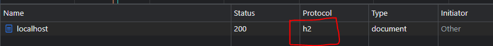

# Enable HTTP/2 on Apache HTTP Server
- To use apache with HTTP/2, requires HTTPS enabled on the server since most of the browsers currently only support HTTP/2 over an encrypted connection. The website must be accessed over `https://` to leverage HTTP/2.

## Enable SSL
- For development purpose you can create a self-signed certificate. In production though, a valid certificate signed by a trusted CA must be used.
- To create self-signed certs, run the below command on a unix bash - on windows you can use open `git-bash.exe` that comes installed with git and also has openssl tools bundled into it, OR you can download [CYGWIN tools](https://www.ssl.com/how-to/install-openssl-on-windows-with-cygwin/) to emulate unix commands)

  ``` 
  openssl req -x509 -nodes -days 365 -newkey rsa:2048 -keyout /c/Users/<location>/Apache24/conf/server.key -out /c/Users/<location>/Apache24/conf/server.crt
  ``` 
   `C:\Users\<location>\Apache24` here is the root directory `${SRVROOT}` for the apache server.
   Executing the `openssl` command will prompt you to enter some details, fill them appropriately. The `Common Name (e.g. server FQDN or YOUR name)` is ideally the domain name/IP with which you access the webpage, but for development purpose we keep it as `localhost`
   ```
   Country Name (2 letter code) [AU]:IN
   State or Province Name (full name) [Some-State]:Maharashtra
   Locality Name (eg, city) []:Pune
   Organization Name (eg, company) [Internet Widgits Pty Ltd]: Some Org
   Organizational Unit Name (eg, section) []: Some OU
   Common Name (e.g. server FQDN or YOUR name) []:localhost
   Email Address []:admin@app.com
   ```
  This will create `server.key` and `server.crt` files into the `C:\Users\<location>\Apache24\conf` directory.
- In the `httpd.conf` file uncomment the below 3 lines,
  ```
  LoadModule ssl_module modules/mod_ssl.so
  LoadModule socache_shmcb_module modules/mod_socache_shmcb.so
  Include conf/extra/httpd-ssl.conf
  ```
- In `conf/extra/httpd-ssl.conf` file, you will find the certificates already mapped in the `<VirtualHost>`, it uses the same files `server.key` and `server.crt` that we created in the above step.
  ```
  SSLCertificateFile "${SRVROOT}/conf/server.crt"
  SSLCertificateKeyFile "${SRVROOT}/conf/server.key"
  SSLEngine on
  ```
- Restart the server and open https://localhost:443. Check if the link works and the default page is accessible. The default SSL port configured is 443 in the `conf/extra/httpd-ssl.conf`.
- Note: Until this point it still uses `HTTP/1.1`


## Enable HTTP/2
- To enable HTTP/2, in the `httpd.conf`, uncomment the below line
  ```
  LoadModule http2_module modules/mod_http2.so
  ```
- In the  `conf/extra/httpd-ssl.conf`, add the below line just towards the end and before the ending `</VirtualHost>`
  ```
  Protocols h2 h2c http/1.1
  ```
- Now that the configuration for enabiling HTTP/2 is done, restart the server and verify that HTTP request uses `HTTP/2`
	- Using the `curl` command should output the following
    ```
	$  curl -Iks --http2 https://localhost:443
	HTTP/2 200
	last-modified: Mon, 11 Jun 2007 18:53:14 GMT
	etag: "2e-432a5e4a73a80"
	accept-ranges: bytes
	content-length: 46
	content-type: text/html
	date: Thu, 14 Apr 2022 22:02:56 GMT
	server: Apache/2.4.53 (Win64) OpenSSL/1.1.1n
    ```
	- To confirm the HTTP variants that can be used
    ```
    $  curl -vso /dev/null --http2 https://localhost:443
    *   Trying 127.0.0.1:443...
    * Connected to localhost (127.0.0.1) port 443 (#0)
    * ALPN, offering h2
    * ALPN, offering http/1.1
    ```
  - Additional, you can also check in the browser's developers tool to confirm HTTP/2 being used while accessing the website at https://localhost:443
     
	 

# Reference
- [Creating SSL Certificates](https://www.digitalocean.com/community/tutorials/how-to-create-an-ssl-certificate-on-apache-for-centos-7#step-2-creating-a-new-certificate)
- [Configuring SSL on Apache](https://www.digitalocean.com/community/tutorials/how-to-create-an-ssl-certificate-on-apache-for-centos-7#step-3-setting-up-the-certificate)
- [Enable HTTP/2 on Apache](https://medium.com/tech-learnings/how-to-configure-apache-reverse-proxy-with-http-2-ebc87c1c7bcb)
